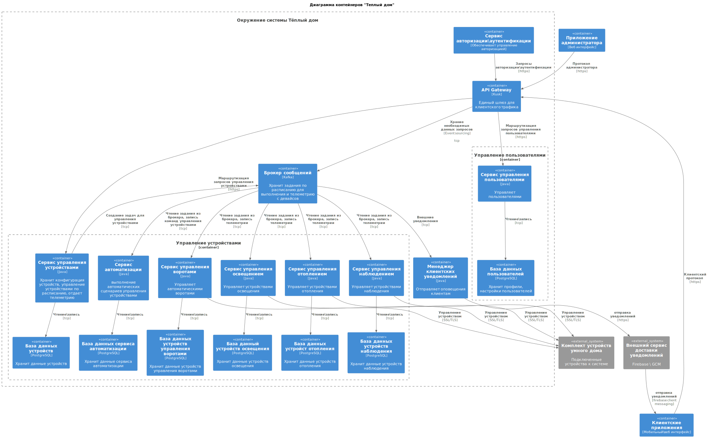
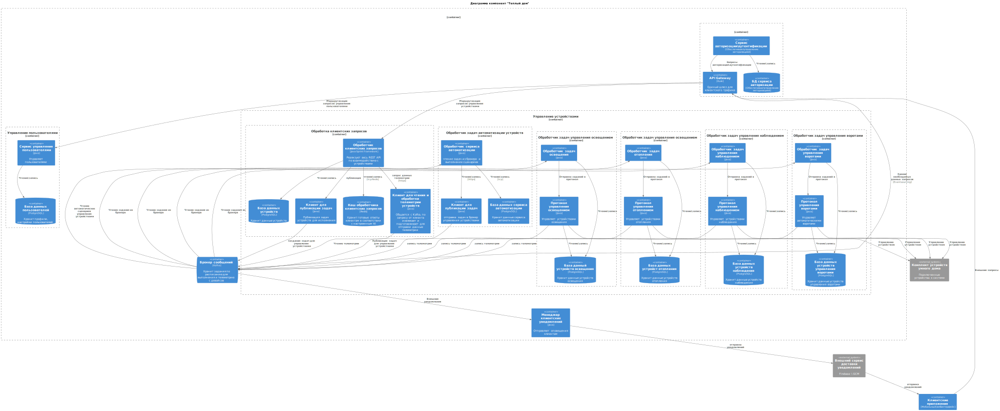
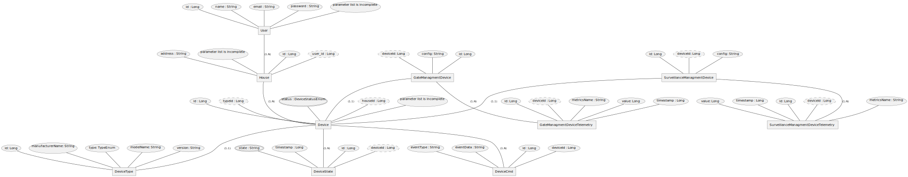

# Архитектурная документация проекта "Теплый дом"

В документе приведены пояснения к заданиям 1-3 первой части третьего спринта.

## Принятые ограничения

1. Все сущности предметной области сделаны максимально простыми, с минимальным количеством полей, чтобы продемонстрировать логику работы и взаимосвязи.
2. Стек технологий принят as-is из примера монолитного приложения, в будущей реализации микросервисов могут быть использованы несколько другие технологии (уточнения после знакомства со второй частью задания)
3. Синтаксис диаграмм контекста, контейнеров, компонент и кода использован с минимальной вариативностью, чтобы показать логику, без детальной проработки.
4. Устройства умного дома являются серверами (открыт серверный сокет) для подключения проекта Теплый дом.
5. Вся специфика устройств (уникальные поля для устройств освещения, видеонаблюдения и тд) скрыта, считаем для демо ее неважной

## Анализ существующего решения

Для решения исходной задачи - управления отоплением - вполне подходил исходный монолит, тк

- нагрузка на приложение оставалась небольшой (не требовалось масштабирование)
- функциональность клиентского приложения была сильно ограничена (низкая вероятность сбоев)
- изменения оборудования, добавление новых устройств были строго под контролем администраторов (целостность данных и рост нагрузки были под контролем, хватало производительности для синхронной обработки данных)

С ростом функциональности, добавлением новых типов устройств, возможность клиентам напрямую подключать новые устройства, а, главное, значительным ростом клиентской базы необходимое новое решение со следующими системными требованиями:

- возможность масштабирования под возрастающую нагрузку
- асинхронное выполнение команд клиентов, чтобы не блокировать систему для других клиентов
- устройчивость к сбоям, неполадки в работе модуля управлением одних устройств не должны приводить к блокировке клиентских приложений и модулей управления другими устройствами
- возможность восстановить состояние системы в случае непредвиденных проблем (event sourcing)
- возможность независимо обновлять компоненты приложения, например, в случае внедрения нового клиентского функционала или поддержке новых типов устройств

## Диаграмма контекста

[Код на github](https://github.com/a-panteleev/architecture-sprint-3/blob/sprint_3/docs/context.puml)

В данной диаграмме показано начальное состояние системы, 2 клиентских приложения, сервер приложения и датчики как внешняя система.

## Диаграмма контейнеров

[Код на github](https://github.com/a-panteleev/architecture-sprint-3/blob/sprint_3/docs/containers.puml)

Данная диаграмма уже иллюстрирует целевое решение, внедрены следующие сущности:

- API Gateway как единая точка входа для приложения, к которому подключен отдельный модуль авторизации и аутентификации
- Брокер сообщений Kafka - служит как хранилище телеметрии, а так же очередь задач на выполенение модулями управления устройствами
- Крупная подсистема управления устройствами
  - Обработчик клиентских запросов для управления устройствами и получения телеметрии
  - ряд модулей для поддержки протокола работы с устройствами
- Модуль для обработки запросов профилей пользователей
- Модуль для доставки клиентских уведомлений
- Внешние системы:
  - Коплекты устройств
  - Сервис доставки пуш-уведомлений

Данная архитектура позволяет реализовать паттерны - EDA, Event sourcing, разделить бизнес логику и логику работы с устройствами.

## Диаграмма компонент

[Код на github](https://github.com/a-panteleev/architecture-sprint-3/blob/sprint_3/docs/components.puml)

Относительно диаграммы контейнеров чуть подробнее отражены компоненты работы с брокером:
- Модуль для публикации сообщений из обработчика клиентского протокола
- Модули для чтения сообщений - воркеры для обработки
- У Сервиса авторизации отражена своя БД

## Диаграмма кода

[Код на github](https://github.com/a-panteleev/architecture-sprint-3/blob/sprint_3/docs/code.puml)

Показан пример диаграммы кода для классов, которые работают с очередью сообщений. DeviceManager выполняет клиентские запросы, преобразует их в команды, далее, лиоб возвращает данные из БД, либо публикует команды в Брокер для последующего исполнения воркерами протокола отдельных устройств. Публикацией занимается DeviceManagementTaskPublisher.
Можно отметить, что на диаграмме указаны как структуры, так и классы.
Так же в данном примере использован компонент из диаграммы компонент - Брокер.

## ER диаграмма

[Код на github](https://github.com/a-panteleev/architecture-sprint-3/blob/sprint_3/docs/er.puml)

В данном примере реализованы основные сущности проекта:

- пользователь `User`
- дом `House`
- устройство `Device`, согласно принятым ограничениям тут не показаны специфичные для отдельных типов устройств поля
- состояние устройств `DeviceState`
- команды для управления устройствами `DeviceCmd`
- данные телеметрии устройств `DeviceTelemetry`

На диаграмме так же отражены отношения между сущностями: один к одному, один ко многим.